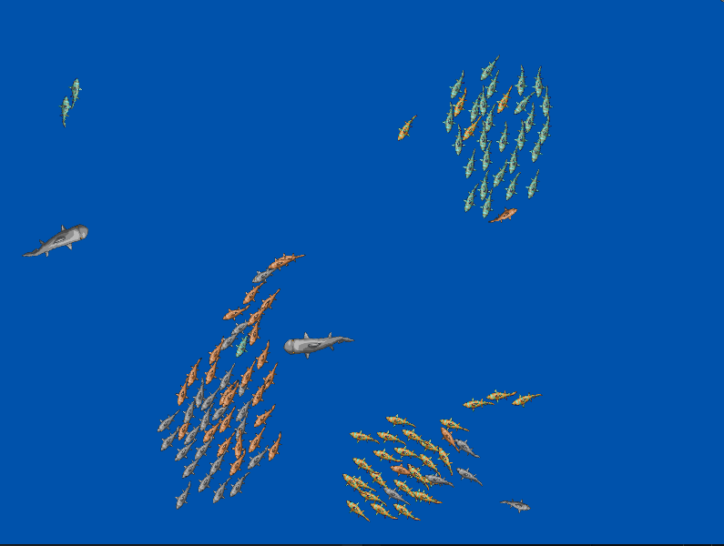

# Fish Flocking Simulation

[See the simulation on this page.](https://eckyputrady.github.io/fish-flocking-simulation/)

- There are 5 types of fishes: 4 smaller ones and a bigger one.
- The big fishes roam around independently.
- The small fishes tend to flock with their own kind while avoiding the big fishes.

# How To

- You need to have rust toolchain installed. [See here for the instruction](https://www.rust-lang.org/tools/install).
- running: `cargo run`
- WASM:
  - building: `cargo build --target wasm32-unknown-unknown --release`
  - running:
    - Setup a webserver in this project root folder, e.g. `cargo install basic-http-server && basic-http-server .`
    - Open the server via web browser

# Credits

1. [Macroquad](https://macroquad.rs/)
2. [Fish Sprites](https://forums.rpgmakerweb.com/index.php?threads/whtdragons-animals-and-running-horses-now-with-more-dragons.53552/)
3. [Boids](https://cs.stanford.edu/people/eroberts/courses/soco/projects/2008-09/modeling-natural-systems/boids.html)